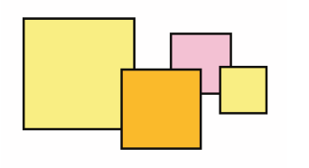

# css-position-absolute-4-boxes

## Requirements

Reproduce (más o menos) este caos de cajas usando CSS.



Recuerda: `position: absolute`, para poder ubicar donde quieras con `top`, `left`, `right` y `bottom`.

## Solution

Puedes visualiza la implementación haciendo click [aquí][exercise-solution-01].


[exercise-solution-01]:   ./solution.html           "See exercise working"

## Explanation

La solución a este ejercicio usa a mayores:

- **CSS3 variables**. Para definir el tamaño de las cajas:
  ```css
  :root {
    --size1: 200px;
    --size2: 150px;
    --size3: 100px;
    --size4: 70px;
  }
  ```
- **CSS3 calculations**. Para mover las cajas automaticamente en función de dichas variables y en base a reglas de separación entre ellas.

  ```css
  .box2 {
    width: var(--size2); height: var(--size2);
    /* .box1 + gap respectivo  */
    top: calc(
        var(--size1)
        - var(--size2) + var(--size2) / 4); /* 1/4 solapado  */
    left: calc(
        var(--size1)
        - var(--size2) / 5); /* 1/5 solapado  */
  }
  ```
- **Movimiento en el eje Z**.
  Para mandar encima o debajo a ciertas cajas:
  ```css
  .box3 {
    z-index: -1;
  }
  ```
  En las otras cajas no es necesario porque siguen el orden correcto (encima).
