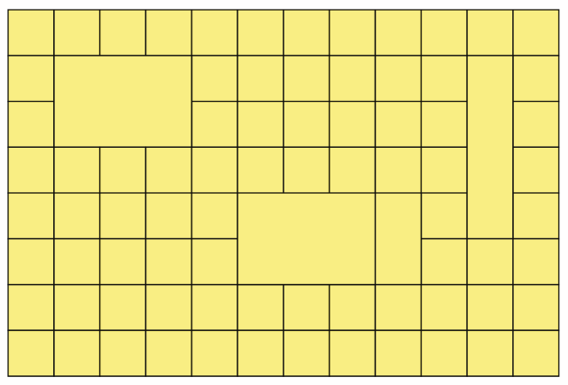

# table-12x8-complex-colspan-rowspan

## Requirements

Construye esta tabla con HTML (no hace falta css).

## Solution

Puedes visualiza la implementación haciendo click [aquí][exercise-solution-01].

[exercise-solution-01]:   ./solution.html           "See exercise working"

**TODO:** Hacer otra solución pero usando `display: grid|flex`.

## Explanation

Se crea un `table` con `border-collapse: collapse` para quitar la separación de doble borde.

En los `td|th` donde sea necesario se introducen `rowspan="N"` eliminando de las `n-1` filas siguientes una celda en la posición adecuada.

En los `td|th` donde sea necesario se introducen `colspan="M"` eliminando de las misma fila `m-1` celdas a continuación.

En las celdas donde se declare/mezcle `rowspan` y `colspan`, eliminaremos `m` celdas de las filas siguientes hasta completar `n-1` filas.
